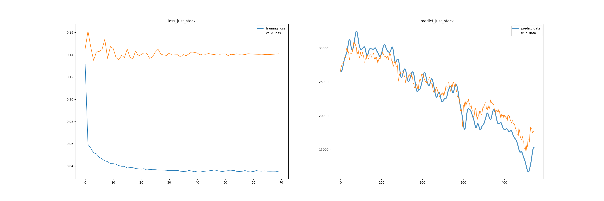

# 商务统计学期末作业

### 一、环境与依赖项

开发环境：

- OS: Ubuntu 20.04.5 LTS x63
- Chrome: 108.0.5359.94 (Official Build) (64-bit)
- GPU: Nvidia GeForce 1650 4GB
-  CUDA: 11.4
- cudnn: 8.4.1
- python: 3.8
- IDE: PyCharm 2022.3 (Professional Edition)

依赖项：

- 见requirements.txt(其中包含部分ROS的库，如果下载不了可以不用管，是以前不小心安装到系统环境里的)

```bash
.
├── Analysis: 数据分析
│   └── analysis.py
├── Data: 数据存放
│   ├── CNY.json
│   ├── Gold.json
│   ├── Oil.json
│   ├── predict.csv
│   ├── predict.json
│   ├── predict_just_stock.csv
│   ├── stock.json
│   ├── true.csv
│   └── USD.json
├── getData: 爬虫
│   └── getData.py
├── LSTM: 网络模型
│   └── lstm.py
├── main.py: 主函数
├── README.assets: reeadme图片
│   ├── 2022-12-16_21-06.png
│   ├── image-20221216212258851.png
│   ├── image-20221216212544032.png
│   └── image-20221216215220167.png
├── README.md
└── requirments.txt: 依赖项
```

### 二、运行方式

激活虚拟环境安装依赖项后

```bash
python3 main.py
```

pycharm运行截图


### 三、函数简介

1. getData.py:

   在设计爬虫时，最初选取的是英为财情网站（https://cn.investing.com） ，但该网站数据较为全面且能在国内正常访问。但实际测试后发现，该网站套用有CloudFlare服务，使用传统request方法不能爬取到有效数据。经过搜寻后发现，CloudFlare识别方式应该为识别常见爬虫包发起https请求时的ssl指纹，破解方式较为繁琐。随后查询到可以破解的cloudscraper。但改库目前是一个付费库，需要加入作者Discord群组才能付费获取api密钥。

   于是退而求其次使用undetected-chromedriver模拟浏览器行为进行爬虫，该库成功获取到了网页内容。但随后发现

   

   这个网站居然还在使用flash作为日期控件，如果模拟用户点击的话写出来的函数不仅复杂并且泛用性过差。然后发现

   

   通过这个api可以直接获取返回的json数据，但又发现这个api也用了ClouFlare的服务，并且不允许跨域调用。但selenium只能更改UA，不能更改headers中的Origin和Referer来伪装。于是只好放弃从这个网站爬数据，转而爬雅虎财经的数据。但雅虎财经在国内无法直接访问，需要先挂代理。

   雅虎财经可以直接访问api来获取股票数据，不再赘述。

   ```python
       def __init__(self):
           self.params = {
               'stock': '%5EHSI',
               'HKD2CNY': 'HKDCNY=X',
               'CrudeOil': 'CL=F',
               'Gold': 'GC=F',
               'USD2HKD': 'HKD=X'
           }
           self.fileName = ['./Data/stock.json', './Data/Oil.json', './Data/Gold.json', './Data/CNY.json',
                            './Data/USD.json']
           self.start_time = int(time.mktime(time.strptime('2003-12-01 08:00:00', '%Y-%m-%d %H:%M:%S')))
           self.end_time = int(time.mktime(time.strptime('2022-12-03 08:00:00', '%Y-%m-%d %H:%M:%S')))
           self.url = "https://query1.finance.yahoo.com/v8/finance/chart/"
   ```

   如果想要修改数据网站，更改params中的值即可，更改数据起始时间请按格式修改start_time或end_time。

2. lstm.py:

   LSTM训练使用的是谷歌的tensorflow架构，如果您的电脑中是英伟达显卡的话可以尝试下载相应的CUDA和cudnn以加快训练速度


根据loss和预测图可以看出，训练出的网络在训练集上损失逐步下降，验证集上也较为稳定并且较低。实际近两年数据的预测结果来看略有滞后，但也能够拟合出股票的大概趋势



未添加影响因子的模型预测效果甚至好于考虑汇率、原油和黄金价格的模型
